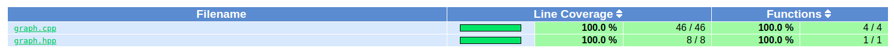

# Directional Weighted Graph
Example of directional weighted graph implemented with C++.

## Build Graph:
```
mkdir build && cd build
cmake ..
make
```
## Build Unit Test and Code Coverage
```
cd test && mkdir build && cd build
cmake ..
make init
make gcov
make lcov
```
## Usage
### Graph: ###
```
./build/graph
```
### Unit Test: ###
```
./test/build
```
### Code Coverage ###
Please open test/build/lcoverage/index.html file with your browser.

